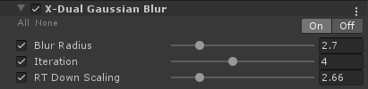
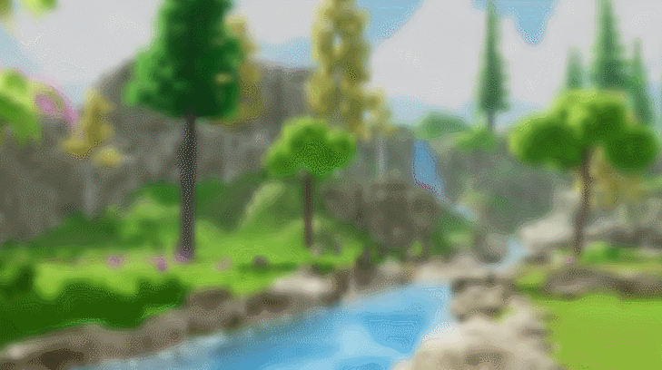

# Dual Gaussian Blur

## Source Code List
- [Shader Code](Shader/DualGaussianBlur.shader)
- [C# Code](DualGaussianBlur.cs)
- [Editor Code](Editor/DualGaussianBlurEditor.cs)

## Property

## Gallery

